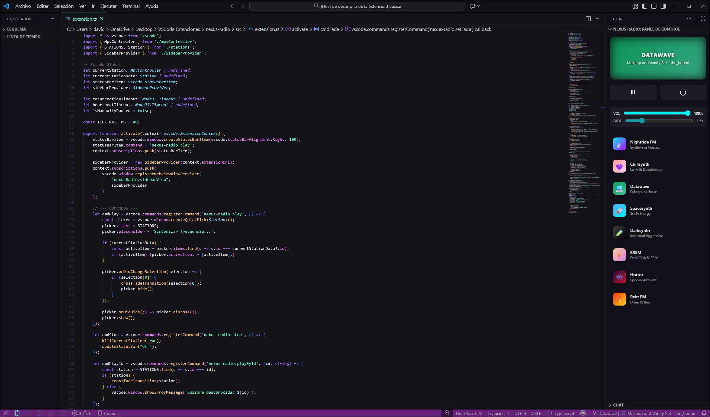

# 📻 Nexus Radio

**Focus via Frequency.**
Una extensión de radio diseñada para mantener el *Flow State* de los programadores. Sintoniza las mejores frecuencias de Synthwave, Lo-Fi y Cyberpunk directamente desde VS Code, sin navegadores ni distracciones.

## ✨ Características Principales

* **🎧 Motor de Audio Híbrido:** Transmisión de alta fidelidad (320kbps) con reconexión inteligente.
* **🔌 Zero Configuración (Nuevo en v0.0.4):** La extensión detecta, descarga y configura automáticamente el motor de audio necesario. ¡Solo instala y reproduce!
* **🎚️ Smart Crossfade:** Transiciones suaves de estilo cinematográfico entre emisoras. Nada de cortes bruscos.
* **⚡ Ligero y Nativo:** Funciona en segundo plano sin consumir recursos de la interfaz de VS Code.
* **📡 8 Emisoras Especializadas:** Curadas por la comunidad de Nightride FM.

## 🎶 Frecuencias Disponibles

| Emisora | Género / Vibe |
| :--- | :--- |
| **Nightride FM** | Synthwave Classics (The OG) |
| **Chillsynth** | Lo-Fi, Downtempo & Chillwave |
| **Datawave** | Cyberpunk Focus & IDM |
| **Spacesynth** | Sci-Fi Energy & Italo Disco |
| **Darksynth** | Industrial, Aggressive & Heavy |
| **EBSM** | Dark Clubbing & EBM |
| **Horror** | Spooky Ambient & Witch House |
| **Rekt FM** | Drum & Bass / Jungle |

## 🚀 Cómo Usar

1.  Abre la **Barra Lateral** (Icono de Torre de Radio) o usa `Ctrl+Shift+P`.
2.  Escribe/Selecciona **`Nexus Radio: Play`**.
3.  Elige una emisora.
4.  *(Solo la primera vez)*: Si no tienes el motor de audio, acepta la descarga automática.

### Comandos Disponibles
* `Nexus Radio: Play` - Abrir selector de emisoras.
* `Nexus Radio: Stop` - Apagar la radio completamente.
* `Nexus Radio: Toggle Pause` - Pausar/Reanudar.
* `Nexus Radio: Set Volume` - Ajustar volumen (0-100).

## ⚙️ Requisitos

**Ninguno.**
A partir de la versión **0.0.4**, Nexus Radio incluye un gestor de dependencias inteligente.
* Si ya tienes [MPV](https://mpv.io/) instalado en tu sistema, la extensión lo usará.
* Si no lo tienes, la extensión descargará una versión portable y aislada automáticamente.

*(Nota para usuarios de Linux: La instalación automática usa AppImage, asegúrate de tener las librerías base de tu distribución, como `libfuse2` en Ubuntu 22.04+).*

## 🔧 Configuración Avanzada

Puedes ajustar el comportamiento en `File > Preferences > Settings`:

* `nexusRadio.transitionDuration`: Segundos que dura el efecto de desvanecimiento al cambiar de emisora (Default: `1.5`).

---

## 🏗️ Release Notes

### 0.0.4 (The Plug & Play Update)
* **NEW:** Sistema de instalación automática de MPV. Ya no se requiere configuración manual del PATH.
* Mejoras en la estabilidad del buffer para redes inestables.

### 0.0.3
* Corrección de iconos y branding en el Marketplace.

### 0.0.2
* Motor de audio reescrito con soporte HLS híbrido.
* Implementación de "Smart Doctor" para resurrección de streams caídos.

---

**Enjoy the silence... or the synth.**
*Desarrollado por Jhosuel Haro.*